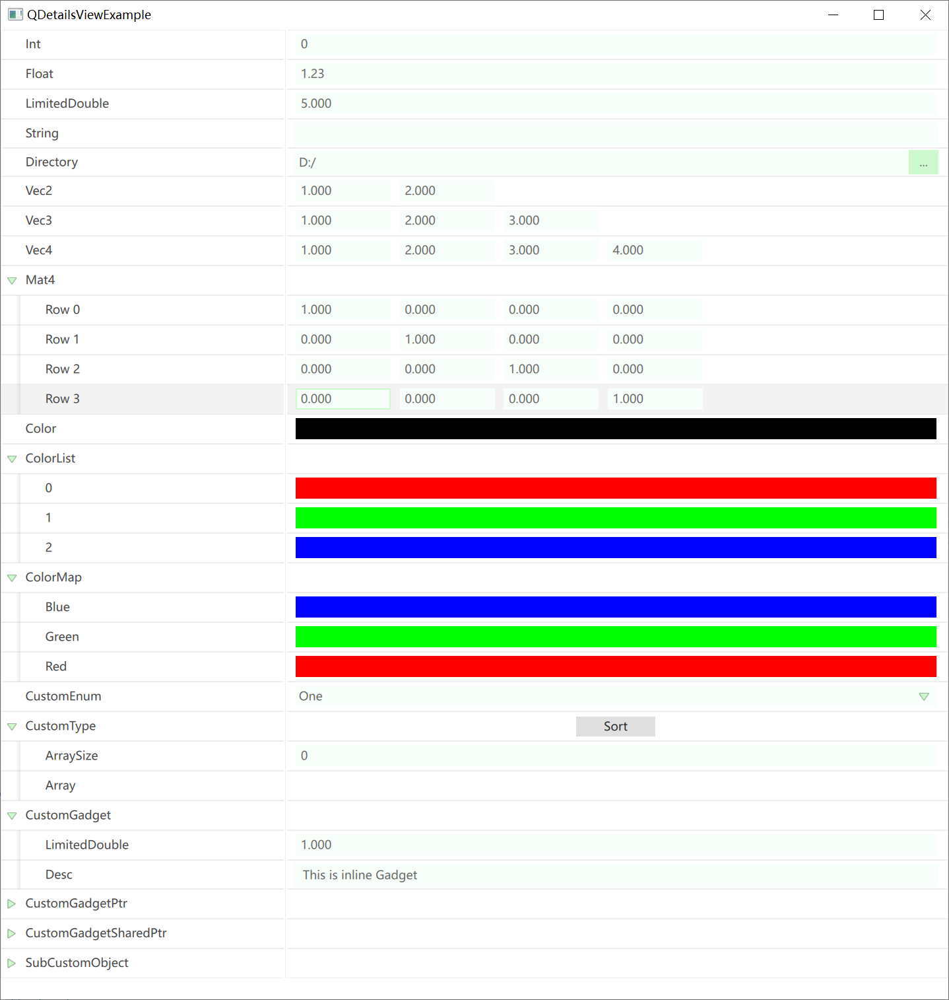

# QDetailsView

[中文用户？点我查看中文介绍](README_zh.md)

Inspired by the details view of Unreal Engine, QDetailsView leverages Qt's reflection system to easily build property editors for qobject.

Its core features are:

- Create type-based control editors that automatically organize the editor layout according to the reflection structure of the object.
- Utilize QML GPU rendering and control management based on the preview view.

## Usage

It is extremely easy to use—simply declare the meta-properties of a `QObject` using **`Q_PROPERTY(...)`**:

```c++
class QCustomObject : public QObject {
    Q_OBJECT
    Q_PROPERTY(int Int READ getInt WRITE setInt)
    Q_PROPERTY(float Float READ getFloat WRITE setFloat)   
    ...
};
```

```c++
QCustomObject obj;
QDetailsView view;
view.setObject(&obj);
view.show();
```

You will get the following result:



## Customization

### About QPropertyHandle

`QPropertyHandle` serves as the unified entry point for QDetailsView to manipulate properties. It is typically constructed via the following interface:

```c++
static QPropertyHandle* QPropertyHandle::FindOrCreate(
    QObject* inParent,      // Parent object that manages the lifecycle of the PropertyHandle
    QMetaType inType,       // Meta-type of the property
    QString inPropertyPath, // Path field of the property
    Getter inGetter,        // Getter function for the property
    Setter inSetter         // Setter function for the property
); 		
```

To ensure that changes to property values are detected by DetailsView, all value modifications must use the interface provided by PropertyHandle:

```c++
QPropertyHandle* handle = QPropertyHandle::Find(object, "propertyName");
if (handle) {
    handle->setVar(QVariant::fromValue(newValue));
}
```

When creating a `QPropertyHandle`, you must specify a `parent`—the handle will be attached to the parent as a child object. Thus, its lifecycle is tied to the parent object. To clean it up, call:

```c++
static void QPropertyHandle::Cleanup(QObject* inParent);
```

### Custom Enum

For enum types, they must be defined within a class and declared using **`Q_ENUM(...)`**:

```c++
class QCustomObject : public QObject {
    Q_OBJECT
public:
    enum QCustomEnum {
        One,
        Two,
        Three
    };
    Q_ENUM(QCustomEnum);
};
```

### Custom Type Editor

For custom types that do not inherit from `QObject`, you first need to declare the type using the macro **`Q_DECLARE_METATYPE(...)`** during definition.

For specific types that require only a single editor control, you can directly register the type editor using the following interface:

```c++
QQuickDetailsViewManager::Get()->registerTypeEditor(
    metaType,
    [](QPropertyHandle* handle, QQuickItem* parent) -> QQuickItem* {
        // Implementation of the editor creation logic
    }
);
```

The source code directory `QQuickDetailsViewBasicTypeEditor.cpp` contains many reference examples, such as the editor for `QDir`:

```c++
registerTypeEditor(
    QMetaType::fromType<QDir>(), 
    [](QPropertyHandle* handle, QQuickItem* parent) -> QQuickItem* {
        QQmlEngine* engine = qmlEngine(parent);
        QQmlContext* context = qmlContext(parent);
        QQmlComponent comp(engine);
        
        comp.setData(R"(
            import QtQuick;
            import QtQuick.Controls;
            import "qrc:/Resources/Qml/ValueEditor"
            DirectorySelector {
                anchors.verticalCenter: parent.verticalCenter
                width: parent.width
            }
        )", QUrl());
        
        QVariantMap initialProperties;
        initialProperties["parent"] = QVariant::fromValue(parent);
        auto valueEditor = qobject_cast<QQuickItem*>(comp.createWithInitialProperties(initialProperties, context));
        
        if (!comp.errors().isEmpty()) {
            qDebug() << comp.errorString();
        }
        
        valueEditor->setParentItem(parent);
        valueEditor->setProperty("value", handle->getVar());
        
        connect(valueEditor, SIGNAL(asValueChanged(QVariant)), handle, SLOT(setVar(QVariant)));		
        connect(handle, SIGNAL(asRequestRollback(QVariant)), valueEditor, SLOT(setValue(QVariant)));
        
        return valueEditor;
    }
);
```

For editor controls that span multiple rows or have complex behaviors, you can extend the property editor by deriving from `IPropertyTypeCustomization`. This class provides two virtual functions:

```c++
class IPropertyTypeCustomization : public QEnableSharedFromThis<IPropertyTypeCustomization>
{
public:
    // Used to assemble the editor for the current property row
    virtual void customizeHeaderRow(QPropertyHandle* inPropertyHandle, QQuickDetailsViewRowBuilder* inBuilder);
    
    // Used to extend child items for the current property row
    virtual void customizeChildren(QPropertyHandle* inPropertyHandle, QQuickDetailsViewLayoutBuilder* inBuilder);
};
```

After implementing the derived class, register it using the following interface:

```c++
QQuickDetailsViewManager::Get()->registerPropertyTypeCustomization<QCustomType, PropertyTypeCustomization_CustomType>();
```

## TODO

- Undo/redo 
- Container operations
- Extended meta-data support
