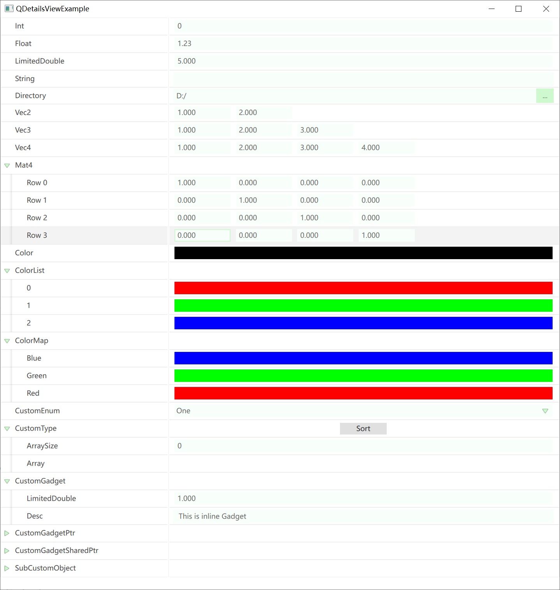

# QDetailsView 

QDetailsView 受虚幻引擎的属性面板所启发，借助Qt的反射系统，可以轻易地搭建对象的属性编辑器。

其核心在于：

- 编写基于类型的控件编辑器，自动根据对象的反射结构来组织编辑器布局。
- 使用QML GPU渲染，基于预览视图的控件管理。

## 使用

它的使用非常简单，只需要使用 **Q_PROPERTY(...) ** 声明 `QObject` 的元属性：

``` c++
class QCustomObject :public QObject {
	Q_OBJECT
    Q_PROPERTY(int Int READ getInt WRITE setInt)
    Q_PROPERTY(float Float READ getFloat WRITE setFloat)   
    ...
};
```

然后创建 `QDetailsView`，并指定Object：

```  c++
QCustomObject obj;
QDetailsView view;
view.setObject(&obj);
view.show();
```

你就能得到：



## 定制化

### 关于 QPropertyHandle

`QPropertyHandle` 是QDetailsView操作属性的统一入口，它通常通过如下接口构建：

``` c++
static QPropertyHandle* QPropertyHandle::FindOrCreate(
    QObject* inParent,  	// 父对象，它会持有PropertyHandle周期
    QMetaType inType, 		// 该属性的元类型
    QString inPropertyPath, // 该属性的路径字段
    Getter inGetter, 		// 该属性的获取器
    Setter inSetter			// 该属性的设置器
); 		
```

为了保证属性值的变动可以被DetailsView响应，所有对值的修改请统一使用PropertyHandle的接口：

``` C++
QPropertyHandle* handle = QPropertyHandle::Find(object, "propertyName");
if(handle){
    handle->setVar(QVariant::fromValue(newValue));
}
```

`QPropertyHandle`创建时要求指定`parent`，它将会作为子对象挂载上去，因此它的生命周期将跟随父对象，如果要清理，请调用：

``` c++
static void QPropertyHandle::Cleanup(QObject* inParent);
```

### 自定义枚举

对于枚举类型，需要使用类内定义的方式，并通过**Q_ENUM(...)**声明：

``` c++
class QCustomObject: public QObject {
	Q_OBJECT
public:
	enum QCustomEnum {
		One,
		Two,
		Three
	};
	Q_ENUM(QCustomEnum);
};
```

### 自定义类型编辑器

非`QObject`的自定义类型，首先需要在定义类型时使用宏**Q_DECLARE_METATYPE(...)**进行声明。

对于只有单个编辑器控件的特定类型，可以使用如下接口直接注册类型编辑器：

``` c++
QQuickDetailsViewManager::Get()->registerTypeEditor(
	metaType,
	[](QPropertyHandle* handle, QQuickItem* parent)->QQuickItem* {

	}
)；
```

在源代码的`QQuickDetailsViewBasicTypeEditor.cpp`目录下有许多参考示例，比如QDir：

``` c++
registerTypeEditor(
    QMetaType::fromType<QDir>(), 
    [](QPropertyHandle* handle, QQuickItem* parent)->QQuickItem* {
        QQmlEngine* engine = qmlEngine(parent);
        QQmlContext* context = qmlContext(parent);
        QQmlComponent comp(engine);
        comp.setData(R"(
                    import QtQuick;
                    import QtQuick.Controls;
                    import "qrc:/Resources/Qml/ValueEditor"
                    DirectorySelector{
                         anchors.verticalCenter: parent.verticalCenter
                         width: parent.width
                    }
                )", QUrl());
        QVariantMap initialProperties;
        initialProperties["parent"] = QVariant::fromValue(parent);
        auto valueEditor = qobject_cast<QQuickItem*>(comp.createWithInitialProperties(initialProperties, context));
        if (!comp.errors().isEmpty()) {
            qDebug() << comp.errorString();
        }
        valueEditor->setParentItem(parent);
        valueEditor->setProperty("value", handle->getVar());
        connect(valueEditor, SIGNAL(asValueChanged(QVariant)), handle, SLOT(setVar(QVariant)));		
        connect(handle, SIGNAL(asRequestRollback(QVariant)), valueEditor, SLOT(setValue(QVariant)));
        return valueEditor;
	}
);
```

对于具有多行或者行为较为复杂的编辑器控件，可以通过派生`IPropertyTypeCustomization`来扩展属性编辑器，它提供两个虚函数：

``` c++
class IPropertyTypeCustomization :public  QEnableSharedFromThis<IPropertyTypeCustomization>
{
public:
    // 用于装配当前属性行的编辑器
	virtual void customizeHeaderRow(QPropertyHandle* inPropertyHandle, QQuickDetailsViewRowBuilder* inBuilder);
    
    // 用于扩展当前属性行的子项
	virtual void customizeChildren(QPropertyHandle* inPropertyHandle, QQuickDetailsViewLayoutBuilder* inBuilder);
};
```

之后使用如下接口进行注册：

``` c++
QQuickDetailsViewManager::Get()->registerPropertyTypeCustomization<QCustomType, PropertyTypeCustomization_CustomType>();
```

## TODO

- 撤销重做
- 容器操作
- 扩展元信息


